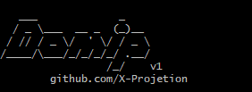

# domain-to-ip
Domain To IP Converter allows you to convert a list of domain names into a list of IPv4 addresses

convert domain names to IP addresses quickly using Python 3, accurately find the IP address of a website.

<h1 align="center">
  
   
  <h4 align="center">Domain To IP Converter</h4>
</h1>
